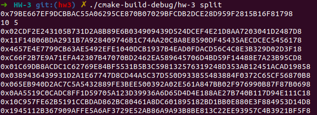

## Задание

Программа, разделяет секретную строку в hex формате длиной 256 bit (например, приватный ключ ECDSA secp256k1) на N частей по схеме Шамира и восстанавливает его при предъявлении любых T частей.

Программа поддерживает два режима работы:

* Разделение секрета: 

  Параметр запуска - `split`. В стандартный ввод передается:

  1. Секретная строка в hex формате (`0xA1C..`)
  2. Число частей ($N$) на которые разделяется секрет ($2 < N < 100$)
  3. Число частей ($Т$) необходимых для восстановления секрета ($2 < T \le N$)

  Затем программа выведет $N$ строк в hex формате с долями секрета.

* Восстановление секрета:

  Параметр запуска - `recover`. В стандартный ввод передается $Т$ строк - доли секрета в hex формате. Предполагается, что передается первые $Т$ долей, в тоже порядке что и при их выводе в режиме `split`.

## Запускаем

### Требования

- Компилятор GCC с поддержкой С++14.
- Утилита cmake v3.16.3.
- OpenSSL 1.1.1f.
- ОС на базе Linux.

### Соборка и запуск

#### Сборка:

```bash
git clone -b hw3 --single-branch https://github.com/GeorgiyX/Decent-HW.git
cd Decent-HW
mkdir build
cd build
cmake .. && cmake --build .
```

#### Запуск:

Запускать программу нужно из корневой папки, с передачей одного параметра (`split` или `recover`) :

```bash
#разделение секрета:
./build/hw-3 split
#восстановление секрета:
./build/hw-3 recover
```

##### Скриншоты работы:

* Режим "split", в котором секрет `0x79BE667EF9DCBBAC55A06295CE870B07029BFCDB2DCE28D959F2815B16F81798` (число в 256 бит) разделяется на 10 частей, для восстановления необходимо предъявить 5 частей.



* Режим "recover", в котором по первым 5 частям разделенного секрета восстановленны исходные 256 бит.

